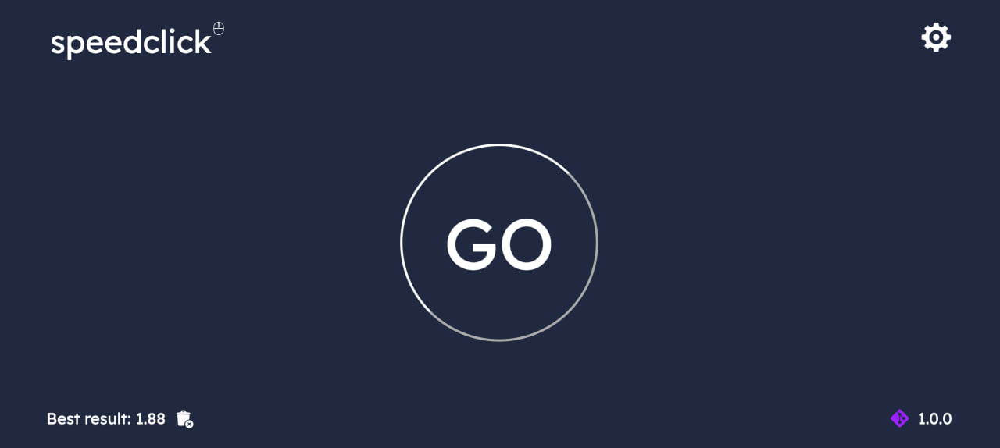
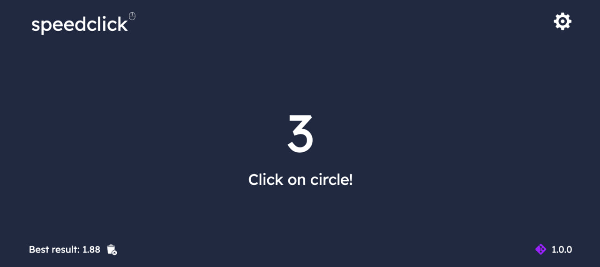

 

# About

SpeedClick - minimalistic and customizable click rate test. In the settings you can specify the number of clicks. The test also takes into account the percentage of button hits. It is possible to save and delete the best result. The screen displays the progress: the total number of clicks and the remaining number of clicks. With this test you can practice mouse control, which can help in computer games.

### 1. Click the Go button 
 

 

### 2. Wait for the timer to end

 

### 3. Click on the button as quickly as possible, it will change its position every time

 

### 4. Install new ridges

